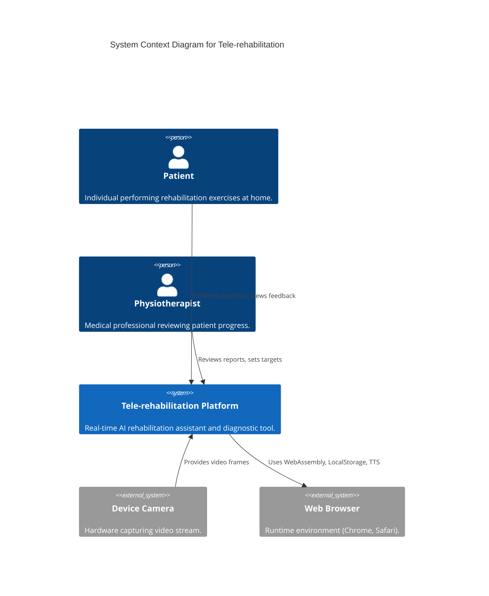
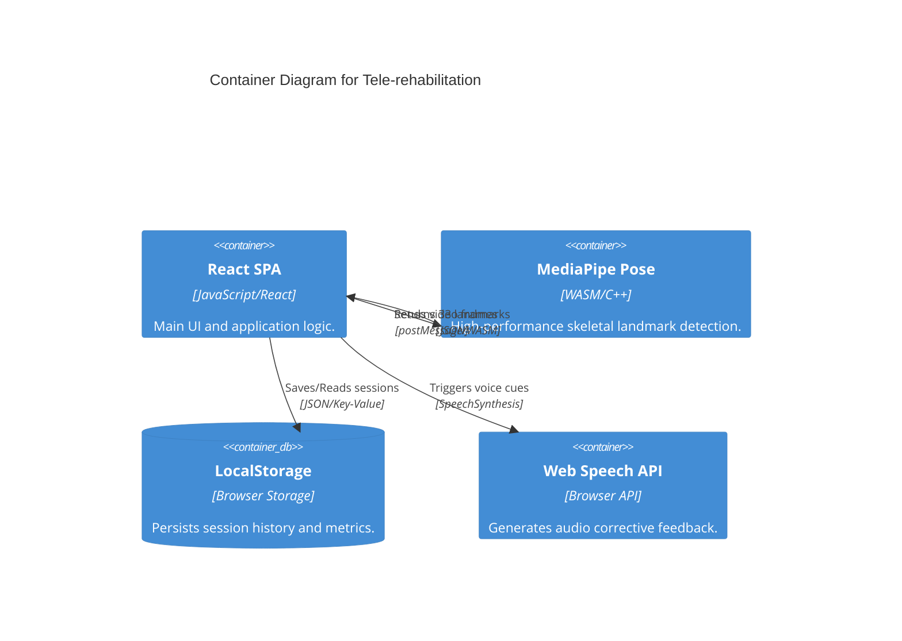
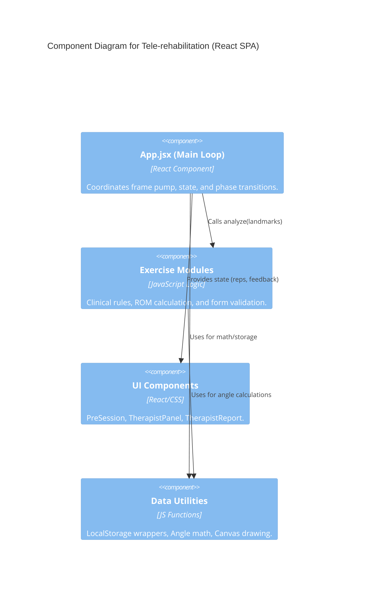
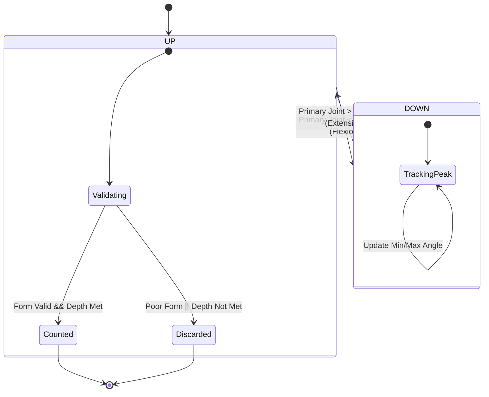
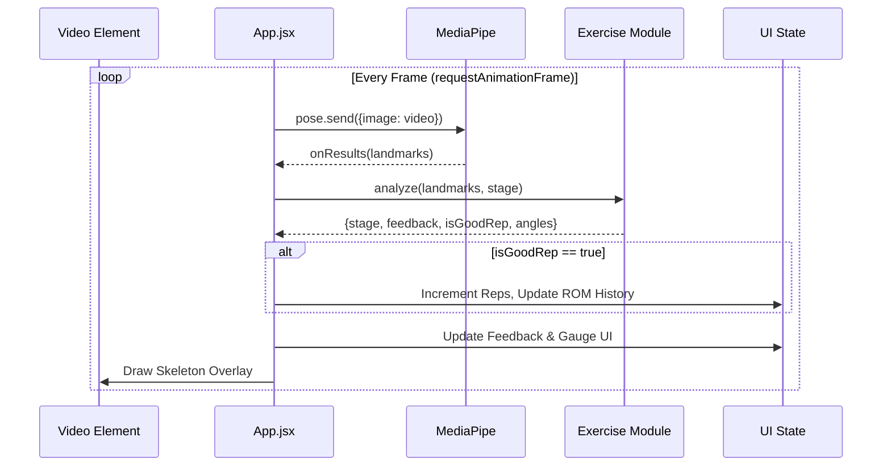
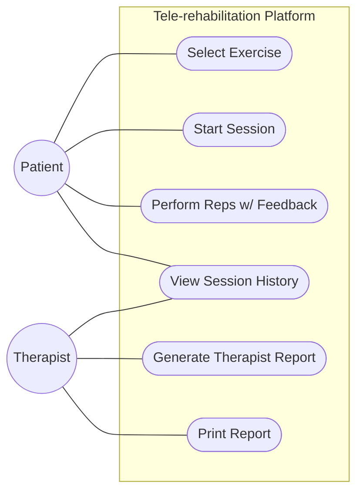
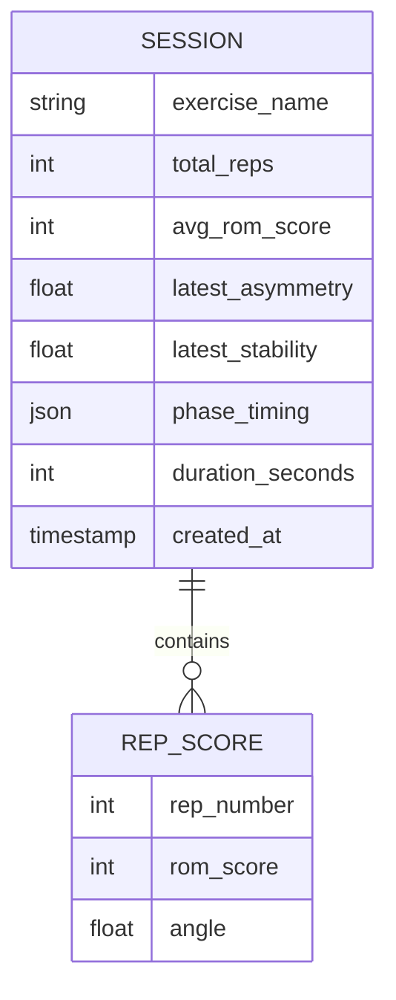
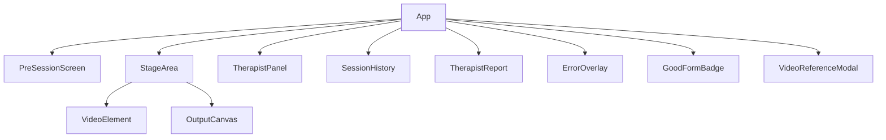

# Tele-rehabilitation - Engineering Diagrams

## 1. C4 Model - Level 1: System Context

Shows how Tele-rehabilitation interacts with users and the environment.

## 2. C4 Model - Level 2: Containers

Technical containers within the Tele-rehabilitation platform.

## 3. C4 Model - Level 3: Components

Internal structure of the React SPA.

## 4. Repetition State Machine

Logic for tracking clinical-grade repetitions.

## 5. Frame Processing Sequence

The lifecycle of a single video frame.

## 6. Use Case Diagram

High-level system interactions.

## 7. Entity Relationship Diagram (ERD)

Structure of stored session data.

## 8. Component Hierarchy

React component tree.

